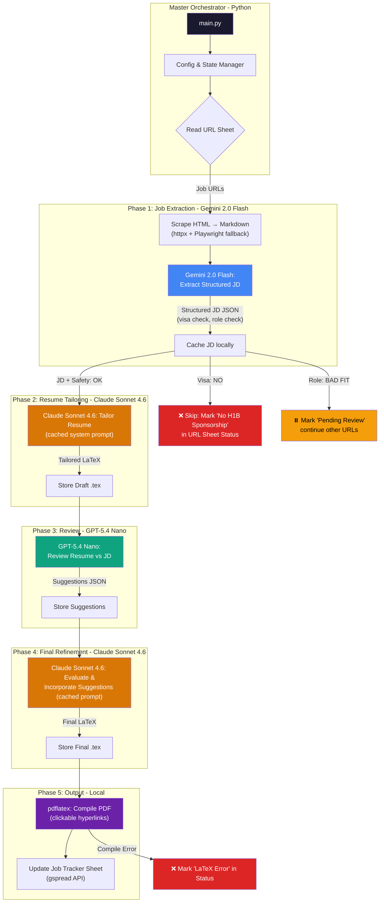

# Multi-Agent Resume Automation - Implementation Plan (v2)

## Goal

Build a Python-based multi-agent resume automation pipeline that reads job URLs from a Google Sheet ("URL Sheet"), extracts job descriptions, tailors a LaTeX resume using three LLMs (Gemini → Claude → ChatGPT → Claude → local pdflatex), auto-compiles to PDF with clickable links, and updates a separate "Job Tracker" sheet — all while **minimizing token usage** via a **hybrid parallel/sequential batch strategy**.

## Architecture Overview



---

## Prerequisites & Setup (What You Need Before We Build)

### 1. API Keys

You need 3 API keys. Here's how to get each:

| Service | Key Name | How to Get |
|---------|----------|-----------|
| Google Gemini | `GEMINI_API_KEY` | [Google AI Studio](https://aistudio.google.com/apikey) → Create API Key (free tier: 15 RPM) |
| Anthropic Claude | `ANTHROPIC_API_KEY` | [Anthropic Console](https://console.anthropic.com/) → API Keys → Create Key |
| OpenAI (GPT-5.4 Nano) | `OPENAI_API_KEY` | [OpenAI Platform](https://platform.openai.com/api-keys) → Create new secret key |

### 2. Google Sheets Service Account (Step-by-Step)

Since you don't have this set up, I'll guide you through it during execution:

1. Go to [Google Cloud Console](https://console.cloud.google.com/)
2. Create a new project (e.g., "Resume Agent")
3. Enable **Google Sheets API** and **Google Drive API**
4. Create a **Service Account** → Download the JSON key file
5. Share both your URL Sheet and Job Tracker sheet with the service account email (e.g., `resume-agent@project.iam.gserviceaccount.com`)
6. Save the JSON key as `config/credentials.json`

### 3. LaTeX Distribution (MiKTeX)

Since you don't have LaTeX installed, we'll install MiKTeX during execution:

```powershell
# Install via winget (or chocolatey)
winget install MiKTeX.MiKTeX

# Verify installation
pdflatex --version
```

> [!NOTE]
> The base resume already uses `\usepackage[pdftex]{hyperref}` which makes all `\href{}` links clickable in the PDF output. MiKTeX's `pdflatex` respects this natively. No extra configuration needed for clickable links.

### 4. Google Sheets Structure

**Sheet 1: URL Sheet** (you provide this — separate spreadsheet)

| URL | Additional Context | Status | Reason |
|-----|-------------------|--------|--------|
| https://jobs.lever.co/company/... | I have 2 years of Spark experience from Appedology | | |
| https://linkedin.com/jobs/... | | | |
| https://example.com/data-engineer | Familiar with Kafka from side project; used dbt daily at Assurety | | |

- `Additional Context`: Optional. Your notes for Claude — extra skills, tools, or experience NOT in the base resume that are relevant to this specific job. Claude will weave these into the tailored resume.
- `Status`: Filled automatically — `Completed`, `Skipped`, `Failed`, `Pending Review`
- `Reason`: Filled on skip/failure — e.g., "No H1B visa sponsorship", "Role not appropriate (awaiting user review)", "LaTeX compilation error"

**Sheet 2: Job Tracker** (separate spreadsheet — filled by the pipeline after success)

| Company | Job Title | Location | Status | Date Applied | Resume PDF Path |
|---------|-----------|----------|--------|-------------|----------------|
| Google | Data Analyst Intern | Mountain View, CA | Resume Generated | 2026-04-05 | output/Hunain Shahzad Google Data Analyst Intern.pdf |

---

## Token Optimization Strategy

### 1. Tiered Model Routing (Cost per 1M tokens)

| Task | Model | Input Cost | Output Cost | Rationale |
|------|-------|-----------|-------------|-----------|
| JD Extraction | Gemini 2.0 Flash | ~$0.075 | ~$0.30 | Cheapest; extraction is simple |
| Resume Tailoring | **Claude Sonnet 4.6** (`claude-sonnet-4-6`) | ~$3.00 | ~$15.00 | Best at following complex constraints |
| Resume Review | **GPT-5.4 Nano** | ~$0.20 | ~$1.25 | Cheapest GPT-5 family; review only |
| Final Refinement | **Claude Sonnet 4.6** (`claude-sonnet-4-6`) | ~$3.00 | ~$15.00 | Consistency with first pass |
| PDF Conversion | Local `pdflatex` | $0 | $0 | No LLM needed |

### 2. Prompt Caching (Claude)
- **Cache the base resume + constraints + instructions as a static system prompt prefix** (~4K tokens)
- Claude's prompt caching gives **90% discount** on cached input tokens after first call
- For a batch of 10 jobs → saves ~36K cached tokens at 90% discount

### 3. Data Minimization
- **HTML → Markdown conversion** before sending to Gemini (reduces tokens by ~60-80%)
- **Structured JSON output** from all LLMs via Pydantic (no wasted prose)
- **Send only the JD + delta suggestions** to Claude on refinement pass (not full context again)
- **Compress JD** to key fields only when passing to GPT-5.4 Nano

### 4. Local Processing Where Possible
- LaTeX → PDF: **local `pdflatex`** (zero cost)
- Google Sheets update: **direct gspread API** (zero cost)
- HTML cleaning: **local `html2text`** library (zero cost)

### Estimated Cost Per Resume

| Phase | Est. Input Tokens | Est. Output Tokens | Est. Cost |
|-------|------------------|-------------------|-----------|
| JD Extraction (Gemini Flash) | ~3,000 | ~1,500 | ~$0.001 |
| Resume Tailoring (Claude 4.6) | ~6,000 (2K cached) | ~4,000 | ~$0.072 |
| Review (GPT-5.4 Nano) | ~8,000 | ~1,500 | ~$0.003 |
| Final Refinement (Claude 4.6) | ~5,000 (2K cached) | ~4,000 | ~$0.069 |
| **Total per resume** | | | **~$0.15** |

### 5. Hybrid Batch Strategy (Parallel + Sequential)

When you provide 10 URLs, the pipeline does **NOT** run the same way 10 times sequentially, nor fully in parallel. It uses a **hybrid approach** that balances speed with token savings:

```mermaid
gantt
    title Batch Processing: 10 URLs (Hybrid Strategy)
    dateFormat X
    axisFormat %s

    section Phase 1 PARALLEL
    Scrape + Extract all 10 URLs concurrently :a1, 0, 10

    section Phase 2-4 SEQUENTIAL
    Job 1 - Claude Tailor + GPT Review + Claude Refine :b1, 10, 25
    Job 2 - Claude Tailor + GPT Review + Claude Refine :b2, 25, 40
    Job 3 - Claude Tailor + GPT Review + Claude Refine :b3, 40, 55
    Job 4-10 ... :b4, 55, 145

    section Phase 5 IMMEDIATE
    PDF compile + Sheet update (after each job) :c1, 25, 27
```



| Phase | Strategy | Why |
|-------|----------|-----|
| **Phase 1** (Scrape + Gemini Extract) | **PARALLEL** (all 10 at once) | Scraping is I/O-bound. Gemini Flash has no cross-request caching benefit. Running all 10 concurrently saves ~80% wall-clock time. |
| **Phases 2-4** (Claude Tailor → GPT Review → Claude Refine) | **SEQUENTIAL** (one job at a time) | **Claude prompt caching requires sequential requests.** The cached system prompt (base resume + constraints) gets a 90% discount on the 2nd-10th requests. Running in parallel would create 10 separate caches — wasting ~$0.06 per extra job. |
| **Phase 5** (PDF + Sheet) | **IMMEDIATE** (after each Phase 4) | Local pdflatex is instant (~2 sec). No reason to batch this. |

**Token savings from sequential Claude calls (10 jobs):**

| Approach | Claude Input Token Cost (10 jobs) | Savings |
|----------|----------------------------------|--------|
| Fully Parallel (no cache reuse) | ~6K tokens × $3/1M × 10 × 2 passes = ~$0.36 | Baseline |
| Sequential (cache reuse on 2-10) | ~6K × $3/1M × 2 + ~6K × $0.30/1M × 18 = ~$0.068 | **~81% cheaper** |

> [!TIP]
> **Bottom line**: For 10 URLs, sequential Claude calls save **~$0.29** compared to parallel. The total batch cost drops from **~$1.55** (parallel) to **~$1.26** (hybrid), while Phase 1 parallelism keeps total time reasonable (~15-20 min for 10 jobs instead of ~30 min fully sequential).

---

## Resume Tailoring Constraints (Baked Into System Prompt)

All original 20 constraints are preserved, **plus** these new rules added from your feedback:

### New Constraints (21-25)

| # | Constraint | Implementation |
|---|-----------|----------------|
| 21 | **VU MCS Decision**: Evaluate whether including VU Master in Computer Science hurts chances for the specific internship. If it creates confusion or dilutes the analytics narrative, remove it. | Claude analyzes JD role type; if purely analytics/DS, may hide VU MCS |
| 22 | **No dashes**: Never use em-dashes (`—`), en-dashes (`–`), or double hyphens (`--`) anywhere in the resume. Use commas, semicolons, or restructure sentences instead. | Explicit constraint in system prompt + post-processing regex check |
| 23 | **Summary format**: Don't write "4+ years of experience". Write "hands-on experience" instead. End summary with: "seeking a Summer 2026 {job_title} internship as part of the MS Analytics curriculum to..." | Template enforced in system prompt |
| 24 | **Auto-compile**: Pipeline auto-compiles LaTeX to PDF without manual review. | Orchestrator skips review step |

### Full Constraints List in System Prompt

```
<constraints>
1. Maintain brutal honesty - do not soften assessments
2. Focus on evidence-based evaluation, not subjective opinions
3. Consider real-world hiring practices
4. Avoid generic advice - all recommendations specific to exact job and candidate
5. Don't make assumptions about unmentioned skills
6. Account for both technical and soft skill requirements
7. Summary: strictly 2-3 sentences
8. Don't oversell experience unrealistically
9. Don't change job titles. Relate experience to JD and make relevant
10. Don't combine membership and certification sections
11. Evaluate if Financial & Operational Analysis section is needed; remove if not
12. Balance technical specificity and business impact; follow ABC format; no keyword stuffing
13. If experience is related to role, keep some points as-is
14. Relate responsibilities to JD without copying word-for-word
15. Maintain concise, strong summary (2-3 sentences) giving recruiter strong positive impression
16. If visa sponsorship not available, STOP and report to orchestrator
17. Warn if role not appropriate for background; report to orchestrator for user consent
18. NEVER use em-dashes, en-dashes, or double dashes (-- or —) anywhere
19. Don't explain how experience relates to requirements in the resume text
20. Ensure resume doesn't exceed 2 pages
21. Evaluate whether VU Pakistan Master in Computer Science helps or hurts for this specific role.
    If it creates confusion or dilutes the analytics narrative, REMOVE it from Education section.
22. In Professional Summary: use "hands-on experience" NOT "X+ years of experience"
23. End Professional Summary with: "seeking a Summer 2026 [exact job title from JD] internship
    as part of the MS Analytics curriculum to [relevant completion based on JD]"
24. Target: 90-95% ATS match, authentic but role-appropriate
25. EXPERIENCE-TITLE ALIGNMENT: After editing experience bullet points, verify each section
    still authentically matches the job title held. Add 1-2 JD-relevant points per section,
    but KEEP 1-2 original points. Do NOT repeat the same keywords across all experience
    sections. The resume should read as natural career progression.
</constraints>
```

---

## Proposed Changes

### Project Structure

```
Resume Agent/
├── config/
│   ├── settings.py              # API keys, paths, model configs
│   ├── .env                     # Secrets (gitignored)
│   ├── credentials.json         # Google service account key (gitignored)
│   └── prompts/
│       ├── system_prompt.txt    # Base resume + constraints + instructions (cached)
│       ├── extraction_prompt.txt
│       ├── review_prompt.txt
│       └── refinement_prompt.txt
├── agents/
│   ├── __init__.py
│   ├── orchestrator.py          # Master agent: coordinates the pipeline
│   ├── gemini_agent.py          # JD extraction via structured output
│   ├── claude_agent.py          # Resume tailoring (with prompt caching)
│   └── chatgpt_agent.py         # Resume review (GPT-5.4 Nano)
├── services/
│   ├── __init__.py
│   ├── sheets_service.py        # Google Sheets read (URL sheet) + write (Job Tracker)
│   ├── scraper.py               # URL → clean markdown (httpx + Playwright fallback)
│   └── latex_compiler.py        # .tex → .pdf via pdflatex (clickable links)
├── models/
│   ├── __init__.py
│   └── schemas.py               # Pydantic models for JD, Resume, Review
├── data/
│   ├── base_resume.tex          # Your master resume template
│   ├── output/                  # Generated resumes (tex + pdf)
│   └── cache/                   # Cached JDs and intermediate results
├── tests/
│   ├── test_scraper.py
│   ├── test_agents.py
│   └── test_compiler.py
├── main.py                      # CLI entry point
├── requirements.txt
└── .gitignore
```

---

### Component Details

---

#### [NEW] `config/settings.py`

Central configuration with environment variable loading:
- API keys from `.env`
- Model selection per agent (easy to swap):
  - `GEMINI_MODEL = "gemini-2.0-flash"`
  - `CLAUDE_MODEL = "claude-sonnet-4-6"` (Sonnet 4.6, released Feb 17 2026)
  - `CHATGPT_MODEL = "gpt-5.4-nano"` (cheapest GPT-5 family)
- File paths, separate Google Sheet IDs for URL sheet and Job Tracker
- Token budget limits per agent

#### [NEW] `config/prompts/system_prompt.txt`

**Token optimization critical file.** This is the static prefix cached by Claude:
- Contains the full base resume LaTeX
- Contains all 25 constraints verbatim
- Contains the **6-step analysis workflow** (see below)
- Contains the summary template rule
- Contains the VU MCS evaluation instruction
- Contains the dash prohibition rule
- Structured so it **never changes between jobs** (maximizes cache hits)
- Dynamic content (the JD) goes in the **user message**, NOT here

**6-Step Analysis Workflow (baked into system prompt):**

```
<analysis_workflow>
When tailoring a resume, follow these 6 steps IN ORDER.
Steps 1-3 are your INTERNAL reasoning (do not output them).
Steps 4-6 produce the final LaTeX output.

Step 1 - ANALYZE JOB DESCRIPTION:
  List the key skills, experiences, qualifications, and tools the role requires.
  Identify the top 5 "must-have" vs "nice-to-have" requirements.
  Note the seniority level, domain focus, and technical stack.

Step 2 - REVIEW CURRENT RESUME:
  List what the base resume currently highlights: skills, tools, experience areas,
  quantified achievements, and domain expertise.
  Identify the candidate's strongest selling points for this specific role.

Step 3 - GAP ANALYSIS & STRATEGY:
  Compare Step 1 and Step 2. For each gap:
  - Can it be addressed by REWORDING existing experience? (preferred)
  - Can the Additional Context provided fill it?
  - Is it a genuine experience gap that cannot be fabricated?
  Plan specific modifications: which bullet points to rewrite, which to keep,
  which sections to emphasize or de-emphasize.

Step 4 - REWRITE RESUME:
  Using the strategy from Step 3, produce the tailored LaTeX resume.
  Emphasize relevant skills and experiences. Apply all constraints.
  Output ONLY valid LaTeX code.

Step 5 - SELF-REVIEW:
  Before finalizing, check for: clarity, conciseness, impact, ATS keyword coverage,
  constraint violations (dashes, summary format, page limit), and natural flow.

Step 6 - EXPERIENCE-TITLE ALIGNMENT CHECK:
  For EACH experience section, evaluate: does the edited content still match
  the actual job title held? If the edits have drifted too far from the original role:
  - Add 1-2 bullet points that are relevant to the TARGET job description
  - BUT keep 1-2 ORIGINAL bullet points that authentically match the job title held
  - Do NOT repeat the same keywords across every experience section
  - Keep it subtle: the resume should read as natural career progression,
    not as if every past job was identical to the target role
</analysis_workflow>
```

#### [NEW] `models/schemas.py`

Pydantic models that enforce structured JSON output from all LLMs:

```python
from pydantic import BaseModel, Field

class JobDescription(BaseModel):
    job_title: str
    company: str
    location: str
    visa_sponsorship: bool | None = Field(
        description="Whether the job offers H1B visa sponsorship. "
                    "None if not mentioned."
    )
    experience_level: str
    key_requirements: list[str]
    preferred_qualifications: list[str]
    key_skills: list[str]
    responsibilities: list[str]
    salary_range: str | None
    is_role_appropriate: bool = Field(
        description="Whether the role is appropriate for a candidate with "
                    "data science, analytics, and BI background seeking "
                    "analytics/DS internships"
    )
    role_appropriateness_reason: str = Field(
        description="Why the role is or is not appropriate"
    )
    full_description_text: str = Field(
        description="The complete job description text for downstream agents"
    )

class RevisionSuggestion(BaseModel):
    section: str  # e.g., "Professional Summary", "Experience > Assurety"
    current_text: str
    suggested_text: str
    rationale: str
    priority: str = Field(description="'critical', 'important', or 'nice-to-have'")

class CriticalGap(BaseModel):
    requirement: str  # What the JD requires
    candidate_status: str  # What the candidate has (or doesn't)
    severity: str = Field(description="'dealbreaker', 'significant', or 'minor'")
    can_be_addressed_in_resume: bool  # Can rewording fix it, or is it a real gap?

class ResumeReview(BaseModel):
    overall_ats_score: int = Field(ge=0, le=100)
    
    # Brutally Honest Assessment
    critical_gaps: list[CriticalGap] = Field(
        description="Major mismatches between resume and JD requirements. "
                    "Be specific: what's missing and how bad is it?"
    )
    reality_check: str = Field(
        description="Honest assessment of interview chances and competitive "
                    "position. No sugar-coating. Include estimated percentile "
                    "ranking among likely applicants."
    )
    recommendation: str = Field(
        description="One of: 'APPLY - Strong Match', 'APPLY - Competitive', "
                    "'APPLY WITH CAVEATS', 'UPSKILL FIRST', or 'LOOK ELSEWHERE'"
    )
    recommendation_reasoning: str = Field(
        description="2-3 sentences explaining the recommendation"
    )
    
    # Specific Improvements
    strengths: list[str]  # What's working well
    weaknesses: list[str]  # What's hurting the resume
    keyword_gaps: list[str]  # Missing ATS keywords from JD
    suggestions: list[RevisionSuggestion]  # Actionable fixes
    dash_violations: list[str] = Field(
        description="Any instances of em-dashes, en-dashes, or -- found"
    )
```

Using Pydantic schemas means:
- LLMs return **only structured data** (no wasted prose tokens)
- Downstream agents consume **only what they need** (no re-parsing)
- Validation catches malformed responses before they propagate
- `CriticalGap.can_be_addressed_in_resume` tells Claude whether to attempt a fix or skip
- `dash_violations` field catches constraint #18/#22 violations

---

#### [NEW] `services/scraper.py`

Fetches job page HTML and converts to clean markdown:

```python
import httpx
import html2text
from playwright.async_api import async_playwright

class JobScraper:
    def __init__(self):
        self.h2t = html2text.HTML2Text()
        self.h2t.ignore_links = False
        self.h2t.ignore_images = True
        self.h2t.ignore_emphasis = False
        self.h2t.body_width = 0  # No line wrapping
    
    async def scrape(self, url: str) -> str:
        """Scrape URL, falling back to Playwright for JS-rendered sites."""
        # Attempt 1: Fast HTTP fetch
        try:
            text = await self._fetch_httpx(url)
            if self._looks_like_job_page(text):
                return text
        except Exception:
            pass
        
        # Attempt 2: Playwright for JS-rendered pages (LinkedIn, Greenhouse, Lever)
        return await self._fetch_playwright(url)
    
    async def _fetch_httpx(self, url: str) -> str:
        async with httpx.AsyncClient(follow_redirects=True, timeout=15) as client:
            resp = await client.get(url, headers={"User-Agent": "Mozilla/5.0 ..."})
            resp.raise_for_status()
            markdown = self.h2t.handle(resp.text)
            return markdown[:15000]  # Token budget guard
    
    async def _fetch_playwright(self, url: str) -> str:
        async with async_playwright() as p:
            browser = await p.chromium.launch(headless=True)
            page = await browser.new_page()
            await page.goto(url, wait_until="networkidle")
            html = await page.content()
            await browser.close()
            markdown = self.h2t.handle(html)
            return markdown[:15000]
    
    def _looks_like_job_page(self, text: str) -> bool:
        """Check if the page actually has job content vs empty JS shell."""
        job_indicators = ["requirements", "qualifications", "responsibilities",
                         "experience", "apply", "salary", "benefits"]
        text_lower = text.lower()
        return sum(1 for kw in job_indicators if kw in text_lower) >= 3
```

- Uses `httpx` first for speed (most direct job pages)
- **Falls back to Playwright** for JS-rendered sites (LinkedIn, Greenhouse, Lever, Workday)
- HTML → Markdown via `html2text` → **60-80% token reduction**
- Truncates to 15K chars to guard token budget
- Caches results locally to avoid re-scraping

---

#### [NEW] `agents/gemini_agent.py`

**Role**: Extract structured job description from raw page content.

```python
from google import genai
from google.genai import types

class GeminiAgent:
    def __init__(self):
        self.client = genai.Client(api_key=settings.GEMINI_API_KEY)
        self.model = settings.GEMINI_MODEL  # "gemini-2.0-flash"
    
    async def extract_job_description(self, page_markdown: str) -> JobDescription:
        response = self.client.models.generate_content(
            model=self.model,
            contents=(
                "Extract the complete job description details from this page content. "
                "Pay special attention to whether the posting mentions visa sponsorship "
                "(H1B, work authorization, etc). If visa sponsorship is explicitly not "
                "offered, set visa_sponsorship=false. If not mentioned, set to null.\n\n"
                "Also evaluate if this role is appropriate for a candidate with: "
                "MS Analytics (Georgia Tech), 4+ years data science/analytics/BI experience, "
                "Python, SQL, Tableau, PowerBI, ML background.\n\n"
                f"PAGE CONTENT:\n{page_markdown}"
            ),
            config=types.GenerateContentConfig(
                response_mime_type="application/json",
                response_schema=JobDescription,
            ),
        )
        return JobDescription.model_validate_json(response.text)
```

**Token optimization**: Structured output schema forces concise JSON — no wasted prose tokens.

---

#### [NEW] `agents/claude_agent.py`

**Role**: Tailor resume with prompt caching for base resume + all 24 constraints.

```python
import anthropic

class ClaudeAgent:
    def __init__(self):
        self.client = anthropic.Anthropic(api_key=settings.ANTHROPIC_API_KEY)
        self.model = settings.CLAUDE_MODEL  # "claude-sonnet-4-6"
        self._system_prompt = self._load_system_prompt()  # Loaded ONCE
    
    def _load_system_prompt(self) -> list:
        """Load base resume + constraints as cacheable system prompt."""
        with open("config/prompts/system_prompt.txt") as f:
            content = f.read()
        return [{
            "type": "text",
            "text": content,
            "cache_control": {"type": "ephemeral"}  # Enable caching
        }]
    
    async def tailor_resume(self, jd: JobDescription,
                            additional_context: str = "") -> str:
        """First pass: Create tailored resume from JD."""
        
        # Build user message with optional additional context
        user_msg = (
            f"Tailor my resume for this job. Output ONLY valid LaTeX code.\n\n"
            f"Job Details:\n{jd.model_dump_json(indent=2)}\n\n"
        )
        
        if additional_context:
            user_msg += (
                f"ADDITIONAL CONTEXT FROM CANDIDATE (incorporate naturally):\n"
                f"{additional_context}\n"
                f"Note: Weave this into relevant experience sections. Do not add "
                f"a new section for it. Make it sound like part of the original "
                f"experience, not an afterthought.\n\n"
            )
        
        user_msg += (
            f"Follow the 6-step analysis workflow in your instructions.\n"
            f"Steps 1-3: internal reasoning (analyze JD, review resume, gap analysis).\n"
            f"Steps 4-6: produce the final LaTeX output.\n\n"
            f"Key reminders:\n"
            f"- Evaluate if VU MCS should be kept or removed for this role\n"
            f"- Use 'hands-on experience' not 'X+ years'\n"
            f"- End summary with: 'seeking a Summer 2026 {jd.job_title} "
            f"internship as part of the MS Analytics curriculum to...'\n"
            f"- NEVER use -- or em-dashes or en-dashes\n"
            f"- Keep all \\href{{}} links intact for clickable PDF output\n"
            f"- Step 6: verify each experience section still matches its job title; "
            f"add 1-2 relevant points but keep 1-2 originals; don't repeat keywords"
        )
        
        response = self.client.messages.create(
            model=self.model,
            max_tokens=8000,
            system=self._system_prompt,  # CACHED — 90% cheaper after 1st call
            messages=[{"role": "user", "content": user_msg}]
        )
        latex = response.content[0].text
        # Post-processing: strip em/en dashes as safety net
        latex = latex.replace("—", ",").replace("–", ",").replace("--", ",")
        return latex
    
    async def refine_resume(self, draft_latex: str,
                            review: "ResumeReview") -> str:
        """Second pass: Incorporate GPT-5.4 Nano's brutal review."""
        
        # Build concise review summary for Claude
        gaps_text = "\n".join([
            f"- GAP [{g.severity}]: {g.requirement} → {g.candidate_status} "
            f"(fixable by rewording: {g.can_be_addressed_in_resume})"
            for g in review.critical_gaps
        ])
        
        suggestions_text = "\n".join([
            f"- [{s.priority}] Section: {s.section}\n"
            f"  Suggested: {s.suggested_text}\n"
            f"  Rationale: {s.rationale}"
            for s in review.suggestions
        ])
        
        response = self.client.messages.create(
            model=self.model,
            max_tokens=8000,
            system=self._system_prompt,  # CACHED — same prefix = same cache
            messages=[{
                "role": "user",
                "content": (
                    f"Here is my draft resume:\n```latex\n{draft_latex}\n```\n\n"
                    f"A brutal job fit reviewer assessed this resume:\n\n"
                    f"ATS Score: {review.overall_ats_score}/100\n"
                    f"Recommendation: {review.recommendation}\n"
                    f"Reality Check: {review.reality_check}\n\n"
                    f"Critical Gaps:\n{gaps_text}\n\n"
                    f"Specific Suggestions:\n{suggestions_text}\n\n"
                    f"YOUR TASK: Evaluate EACH suggestion and gap independently:\n"
                    f"- ACCEPT suggestions marked 'critical' or 'important' if they "
                    f"genuinely improve the resume and don't violate constraints\n"
                    f"- ACCEPT gap fixes ONLY where can_be_addressed_in_resume=True\n"
                    f"- REJECT suggestions that are generic, introduce dashes, "
                    f"violate any constraint, or make the resume sound keyword-stuffed\n"
                    f"- REJECT 'nice-to-have' suggestions unless they clearly add value\n"
                    f"- IGNORE gaps where can_be_addressed_in_resume=False "
                    f"(these are real experience gaps, not resume problems)\n\n"
                    f"Output the final LaTeX resume code ONLY."
                )
            }]
        )
        latex = response.content[0].text
        latex = latex.replace("\u2014", ",").replace("\u2013", ",").replace("--", ",")
        return latex
```

**Token optimization**:
1. System prompt (base resume + 24 constraints) is cached — **90% cheaper** on 2nd+ calls
2. Refinement pass sends only draft + review delta, not the full JD again
3. Claude sees gap severity + fixability flags, so it skips unfixable gaps (saves output tokens)
4. Priority field lets Claude skip low-value suggestions quickly
5. Post-processing catches any remaining dashes without needing an LLM

---

#### [NEW] `agents/chatgpt_agent.py`

**Role**: Brutally Honest Job Fit Analyzer. Uses **GPT-5.4 Nano** (cheapest GPT-5 family).

```python
import openai

BRUTAL_REVIEWER_PROMPT = """
You are a Brutally Honest Job Fit Analyzer with deep expertise in recruitment,
HR practices, ATS systems, and industry hiring standards.

CONTEXT YOU MUST INTERNALIZE:
- The job market is hypercompetitive. Employers receive 200-500+ applications per position.
- Most applicants overestimate their fit. Your job is to be the cold reality check.
- Honest feedback is rare and more valuable than false encouragement.
- The candidate is an MS Analytics student at Georgia Tech with 4+ years in data science,
  analytics engineering, and BI. They need Summer 2026 internships.

YOUR MANDATE:
1. Be BRUTALLY HONEST. No sugar-coating, no softening language, no "overall great resume."
   If the resume is weak for this role, say so directly.
2. Every claim must be EVIDENCE-BASED. Point to specific lines in the resume and specific
   requirements in the JD when identifying gaps or strengths.
3. Distinguish between gaps that can be fixed by REWORDING the resume vs gaps that represent
   REAL missing experience (set can_be_addressed_in_resume accordingly).
4. Your suggestions must be SPECIFIC. "Improve the summary" is useless.
   "Change 'built dashboards' to 'engineered real-time analytics dashboards tracking 25+ KPIs
   for C-suite stakeholders' to match the JD requirement for executive reporting" is useful.
5. ATS keyword matching is important BUT do not suggest keyword stuffing. The resume must
   read naturally while hitting 90-95% of key terms.

FORMATTING RULES (NON-NEGOTIABLE):
- NEVER suggest using em-dashes (\u2014), en-dashes (\u2013), or double hyphens (--) anywhere.
  If you find any in the resume, flag them in dash_violations.
- Verify the summary uses "hands-on experience" NOT "X+ years of experience."
- Verify the summary ends with "seeking a Summer 2026 [job title] internship as part of
  the MS Analytics curriculum to..."
- Don't suggest combining Memberships and Certifications sections.

ANTI-FLATTERY GUARDRAIL:
If you find yourself writing "strong resume" or "well-qualified" without immediately
following it with a specific, critical observation, delete it and be more direct.
"""

class ChatGPTAgent:
    def __init__(self):
        self.client = openai.OpenAI(api_key=settings.OPENAI_API_KEY)
        self.model = settings.CHATGPT_MODEL  # "gpt-5.4-nano"
    
    async def review_resume(self, draft_latex: str,
                            jd: JobDescription) -> ResumeReview:
        response = self.client.beta.chat.completions.parse(
            model=self.model,
            messages=[{
                "role": "system",
                "content": BRUTAL_REVIEWER_PROMPT
            }, {
                "role": "user",
                "content": (
                    f"CRITICALLY analyze this resume against the job description.\n\n"
                    f"JOB: {jd.job_title} at {jd.company} ({jd.location})\n"
                    f"Experience Level: {jd.experience_level}\n"
                    f"Requirements: {', '.join(jd.key_requirements[:10])}\n"
                    f"Key Skills: {', '.join(jd.key_skills[:10])}\n"
                    f"Responsibilities: {', '.join(jd.responsibilities[:8])}\n\n"
                    f"RESUME:\n```latex\n{draft_latex}\n```\n\n"
                    f"Provide your brutal assessment. Target: 90-95% ATS match.\n"
                    f"For each critical gap, specify if it can be fixed by rewording "
                    f"or if it represents a genuine experience gap."
                )
            }],
            response_format=ResumeReview,  # Structured output
        )
        return response.choices[0].message.parsed
```

**Token optimization**:
1. Uses **GPT-5.4 Nano** — $0.20/1M input, $1.25/1M output (cheapest in GPT-5 family)
2. Sends **compressed JD** (key fields only, not full text)
3. Structured output forces specific, evidence-based assessments (no vague prose)
4. Anti-flattery guardrail prevents wasted tokens on generic praise

---

#### [NEW] `services/sheets_service.py`

Handles **two separate spreadsheets** (no LLM involved):

```python
import gspread
from datetime import datetime

class SheetsService:
    def __init__(self, credentials_path: str, url_sheet_id: str, tracker_sheet_id: str):
        self.gc = gspread.service_account(filename=credentials_path)
        self.url_sheet = self.gc.open_by_key(url_sheet_id)
        self.tracker_sheet = self.gc.open_by_key(tracker_sheet_id)
    
    # --- URL Sheet (read URLs, update status/reason) ---
    
    def get_pending_urls(self) -> list[dict]:
        """Read rows where Status is empty from the URL sheet."""
        ws = self.url_sheet.sheet1  # URL, Additional Context, Status, Reason
        records = ws.get_all_records()
        return [
            {
                "url": r["URL"],
                "additional_context": r.get("Additional Context", ""),
                "row": i + 2  # +2 for header + 1-index
            }
            for i, r in enumerate(records)
            if r.get("Status", "") == ""
        ]
    
    def update_url_status(self, row: int, status: str, reason: str = ""):
        """Update Status and Reason columns in the URL sheet."""
        ws = self.url_sheet.sheet1
        ws.update(f"C{row}:D{row}", [[status, reason]])  # Columns C-D (shifted by Additional Context)
    
    # --- Job Tracker Sheet (append new completed jobs) ---
    
    def append_to_tracker(self, data: dict):
        """Add a new row to the Job Tracker after successful resume generation."""
        ws = self.tracker_sheet.sheet1
        ws.append_row([
            data["company"],
            data["job_title"],
            data["location"],
            "Resume Generated",
            datetime.now().strftime("%Y-%m-%d"),
            data["pdf_path"]
        ])
```

---

#### [NEW] `services/latex_compiler.py`

Local LaTeX → PDF compilation with clickable links (zero token cost):

```python
import subprocess
import os
import re

def compile_latex_to_pdf(tex_content: str, company: str,
                         job_title: str, output_dir: str) -> str:
    """Compile LaTeX to PDF with clickable hyperlinks. Returns PDF path."""
    
    # Sanitize filename: "Hunain Shahzad Company Name Job Title.pdf"
    safe_company = re.sub(r'[^\w\s]', '', company).strip()
    safe_title = re.sub(r'[^\w\s]', '', job_title).strip()
    filename = f"Hunain Shahzad {safe_company} {safe_title}"
    
    tex_path = os.path.join(output_dir, f"{filename}.tex")
    pdf_path = os.path.join(output_dir, f"{filename}.pdf")
    
    # Write .tex file
    with open(tex_path, "w", encoding="utf-8") as f:
        f.write(tex_content)
    
    # Compile with pdflatex (hyperref already in template = clickable links)
    # Run twice to resolve references
    for _ in range(2):
        result = subprocess.run(
            ["pdflatex", "-interaction=nonstopmode",
             "-output-directory", output_dir, tex_path],
            capture_output=True, text=True, timeout=60
        )
    
    if not os.path.exists(pdf_path):
        raise RuntimeError(f"PDF compilation failed: {result.stderr[-500:]}")
    
    # Clean up auxiliary files
    for ext in [".aux", ".log", ".out"]:
        aux = os.path.join(output_dir, f"{filename}{ext}")
        if os.path.exists(aux):
            os.remove(aux)
    
    return pdf_path
```

> [!NOTE]
> Your base resume already includes `\usepackage[pdftex]{hyperref}` and uses `\href{}`. The `pdflatex` compiler naturally produces PDFs with clickable links. The compilation runs twice to ensure all cross-references (hyperlinks, TOC) are properly resolved.

---

#### [NEW] `agents/orchestrator.py`

The master pipeline coordinator with **hybrid parallel/sequential batch processing**:

```python
import asyncio
import logging
from datetime import datetime

logger = logging.getLogger("resume_agent")

class Orchestrator:
    def __init__(self):
        self.gemini = GeminiAgent()
        self.claude = ClaudeAgent()
        self.chatgpt = ChatGPTAgent()
        self.sheets = SheetsService(...)
        self.scraper = JobScraper()
    
    # --- Phase 1: Parallel scraping + extraction ---
    
    async def _extract_single(self, url: str, url_row: int,
                               additional_context: str = "") -> tuple:
        """Scrape one URL and extract JD. Runs in parallel with others."""
        try:
            page_text = await self.scraper.scrape(url)
            jd = await self.gemini.extract_job_description(page_text)
            return (url, url_row, jd, additional_context, None)
        except Exception as e:
            return (url, url_row, None, additional_context, str(e))
    
    async def _parallel_extract(self, pending: list) -> list:
        """Phase 1: Scrape + extract ALL URLs concurrently."""
        logger.info(f"🚀 Phase 1: Extracting {len(pending)} job descriptions in parallel...")
        tasks = [
            self._extract_single(job["url"], job["row"], job.get("additional_context", ""))
            for job in pending
        ]
        results = await asyncio.gather(*tasks, return_exceptions=True)
        
        extracted = []
        for result in results:
            if isinstance(result, Exception):
                logger.error(f"❌ Extraction failed: {result}")
                continue
            url, url_row, jd, additional_context, error = result
            if error:
                self.sheets.update_url_status(url_row, "Failed", f"Extraction error: {error[:200]}")
                logger.error(f"❌ {url}: {error[:100]}")
            else:
                extracted.append((url, url_row, jd, additional_context))
                logger.info(f"✅ Extracted: {jd.job_title} at {jd.company}")
        
        return extracted
    
    # --- Phases 2-5: Sequential per job (for Claude cache hits) ---
    
    async def _process_single_job(self, url: str, url_row: int, jd,
                                   additional_context: str = "") -> str | None:
        """Phases 2-5 for one job. Runs SEQUENTIALLY to maximize cache reuse.
        Returns 'pending_review' if role needs user review, None otherwise."""
        try:
            # Safety Check: Visa Sponsorship (Constraint #16)
            if jd.visa_sponsorship == False:
                reason = f"No H1B visa sponsorship for {jd.job_title} at {jd.company}"
                logger.warning(f"⚠️ {reason}")
                self.sheets.update_url_status(url_row, "Skipped", reason)
                return None
            
            # Safety Check: Role Appropriateness (Constraint #17)
            # NON-BLOCKING: flag for review, skip, continue with other jobs
            if not jd.is_role_appropriate:
                reason = (f"{jd.job_title} at {jd.company}: "
                         f"{jd.role_appropriateness_reason}")
                logger.warning(f"⏸️ PAUSED: {reason}")
                self.sheets.update_url_status(
                    url_row, "Pending Review",
                    f"Role fit concern: {jd.role_appropriateness_reason}"
                )
                return "pending_review"
            
            # Phase 2: Tailor Resume (Claude 4.6 — cached system prompt)
            logger.info(f"✍️ Tailoring resume for {jd.job_title} at {jd.company}")
            draft_latex = await self.claude.tailor_resume(jd, additional_context)
            
            # Phase 3: Brutal Review (GPT-5.4 Nano)
            logger.info(f"🔍 Brutal review in progress...")
            review = await self.chatgpt.review_resume(draft_latex, jd)
            logger.info(
                f"📊 ATS: {review.overall_ats_score}/100 | "
                f"Verdict: {review.recommendation} | "
                f"Gaps: {len(review.critical_gaps)} | "
                f"Suggestions: {len(review.suggestions)}"
            )
            
            # Phase 4: Refine (Claude 4.6 — cached system prompt)
            # Pass FULL review (gaps + reality check + suggestions) for informed evaluation
            logger.info(f"🔧 Claude evaluating {len(review.suggestions)} suggestions "
                       f"and {len(review.critical_gaps)} critical gaps...")
            final_latex = await self.claude.refine_resume(draft_latex, review)
            
            # Phase 5: Auto-compile PDF + Update Sheets
            logger.info(f"📄 Compiling PDF...")
            pdf_path = compile_latex_to_pdf(
                final_latex, jd.company, jd.job_title, "data/output"
            )
            
            # Update both sheets
            self.sheets.update_url_status(url_row, "Completed", "")
            self.sheets.append_to_tracker({
                "company": jd.company,
                "job_title": jd.job_title,
                "location": jd.location,
                "pdf_path": pdf_path
            })
            
            logger.info(f"✅ Done: {pdf_path}")
            
        except Exception as e:
            reason = f"Pipeline error: {str(e)[:200]}"
            logger.error(f"❌ Failed for {url}: {reason}")
            self.sheets.update_url_status(url_row, "Failed", reason)
    
    # --- Main entry points ---
    
    async def process_single(self, url: str, url_row: int = None):
        """Process a single URL end-to-end."""
        page_text = await self.scraper.scrape(url)
        jd = await self.gemini.extract_job_description(page_text)
        await self._process_single_job(url, url_row, jd)
    
    async def run_batch(self):
        """Process all pending URLs using hybrid parallel/sequential strategy."""
        pending = self.sheets.get_pending_urls()
        logger.info(f"📋 Found {len(pending)} pending jobs")
        
        # PHASE 1: Parallel — scrape + extract all JDs concurrently
        extracted = await self._parallel_extract(pending)
        logger.info(f"\n📊 Extraction complete: {len(extracted)}/{len(pending)} succeeded\n")
        
        # PHASES 2-5: Sequential — tailor + review + refine + compile one at a time
        # This maximizes Claude prompt cache hits (90% cheaper on 2nd+ calls)
        flagged_for_review = []
        completed = 0
        
        for i, (url, url_row, jd, additional_context) in enumerate(extracted):
            logger.info(f"\n{'='*50}")
            logger.info(f"Processing {i+1}/{len(extracted)}: {jd.job_title} at {jd.company}")
            if additional_context:
                logger.info(f"📝 Additional context: {additional_context[:80]}...")
            
            result = await self._process_single_job(url, url_row, jd, additional_context)
            
            if result == "pending_review":
                flagged_for_review.append({
                    "job": f"{jd.job_title} at {jd.company}",
                    "reason": jd.role_appropriateness_reason,
                    "url": url
                })
            else:
                completed += 1
        
        # --- End-of-batch summary ---
        logger.info(f"\n{'='*50}")
        logger.info(f"🎉 Batch complete: {completed} resumes generated")
        
        if flagged_for_review:
            logger.info(f"\n⏸️ {len(flagged_for_review)} jobs PAUSED for your review:")
            for j, flag in enumerate(flagged_for_review, 1):
                logger.info(f"   {j}. {flag['job']}")
                logger.info(f"      Reason: {flag['reason']}")
                logger.info(f"      URL: {flag['url']}")
            logger.info(f"\n📝 To process these: review in your URL Sheet,")
            logger.info(f"   clear the Status column for approved jobs,")
            logger.info(f"   then run: python main.py --batch")
```

---

#### [NEW] `main.py`

CLI entry point:

```python
import asyncio
import click
import logging

@click.command()
@click.option("--url", help="Process a single job URL")
@click.option("--batch", is_flag=True, help="Process all pending URLs from sheet")
@click.option("--dry-run", is_flag=True, help="Extract JD only, no resume generation")
@click.option("--verbose", is_flag=True, help="Enable debug logging")
def main(url, batch, dry_run, verbose):
    logging.basicConfig(
        level=logging.DEBUG if verbose else logging.INFO,
        format="%(asctime)s %(message)s"
    )
    orchestrator = Orchestrator()
    
    if url:
        asyncio.run(orchestrator.process_single(url))
    elif batch:
        asyncio.run(orchestrator.run_batch())  # Hybrid parallel/sequential
    else:
        click.echo("Usage: python main.py --url <URL> or --batch")

if __name__ == "__main__":
    main()
```

---

#### [NEW] `requirements.txt`

```
anthropic>=0.40.0
openai>=1.60.0
google-genai>=1.0.0
gspread>=6.0.0
google-auth>=2.0.0
httpx>=0.27.0
html2text>=2024.2.26
playwright>=1.40.0
pydantic>=2.5.0
click>=8.1.0
python-dotenv>=1.0.0
```

---

## Key Design Decisions

### Why NOT use LiteLLM/LangChain?

While LiteLLM provides a unified API, it adds complexity and an abstraction layer that:
1. Makes **prompt caching** harder to configure (Claude-specific `cache_control` parameter)
2. Hides **structured output** differences between providers (Gemini `response_schema` vs OpenAI `response_format`)
3. Adds unnecessary dependency overhead for just 3 API calls

Instead, we use **native SDKs** (`anthropic`, `openai`, `google-genai`) directly — simpler, more control, better caching.

### Why GPT-5.4 Nano for review?

At $0.20/1M input tokens, it's the cheapest model in the GPT-5 family while still being competent enough to identify resume gaps. Claude Sonnet 4.6 then evaluates and filters its suggestions, so review quality doesn't need to be perfect — just directionally useful.

### Why local pdflatex instead of an API?

- Zero token cost
- Full control over LaTeX packages (hyperref for clickable links)
- No file size limits
- Works offline
- Your template already uses `\usepackage[pdftex]{hyperref}` — links are clickable natively

### Why two separate Google Sheets?

- **URL Sheet**: Simple input list that you curate. Status/Reason columns provide immediate feedback on why a job was skipped or failed.
- **Job Tracker**: Clean output tracker showing only successful resume generations. Acts as your application log.

### Dash sanitization: defense in depth

Even though the constraint is in the prompt, dashes can slip through. The pipeline uses a **3-layer defense**:
1. **Constraint #18/22** in Claude's system prompt (prevention)
2. **Post-processing regex** in `claude_agent.py` that replaces `—`, `–`, `--` with commas (catch)
3. **GPT-5.4 Nano `dash_violations` field** that flags any remaining dashes (detection)

---

## Verification Plan

### Automated Tests
1. **Unit tests** for each agent with mocked API responses
2. **Scraper test** — verify httpx + Playwright fallback with a known LinkedIn URL
3. **Schema validation** — ensure Pydantic models catch malformed LLM output
4. **LaTeX compilation** — compile the base resume and verify PDF has clickable links
5. **Dash sanitization** — verify `--`, `—`, `–` are caught and replaced

### Manual Verification
1. Run against 3 different job URLs (one LinkedIn, one direct company page, one job board)
2. Open generated PDF and verify all `\href{}` links are clickable
3. Verify ATS score of output using a free ATS checker (target 90-95%)
4. Verify Google Sheet URL Sheet has correct Status/Reason
5. Verify Job Tracker has the new row with correct data

### Commands
```bash
# Install dependencies
pip install -r requirements.txt
playwright install chromium

# Install MiKTeX (one-time)
winget install MiKTeX.MiKTeX

# Run tests
pytest tests/ -v

# Single job dry run (extract JD only)
python main.py --url "https://example.com/job" --dry-run

# Single job full pipeline
python main.py --url "https://example.com/job"

# Batch processing (all pending URLs)
python main.py --batch

# Batch with verbose logging
python main.py --batch --verbose
```
